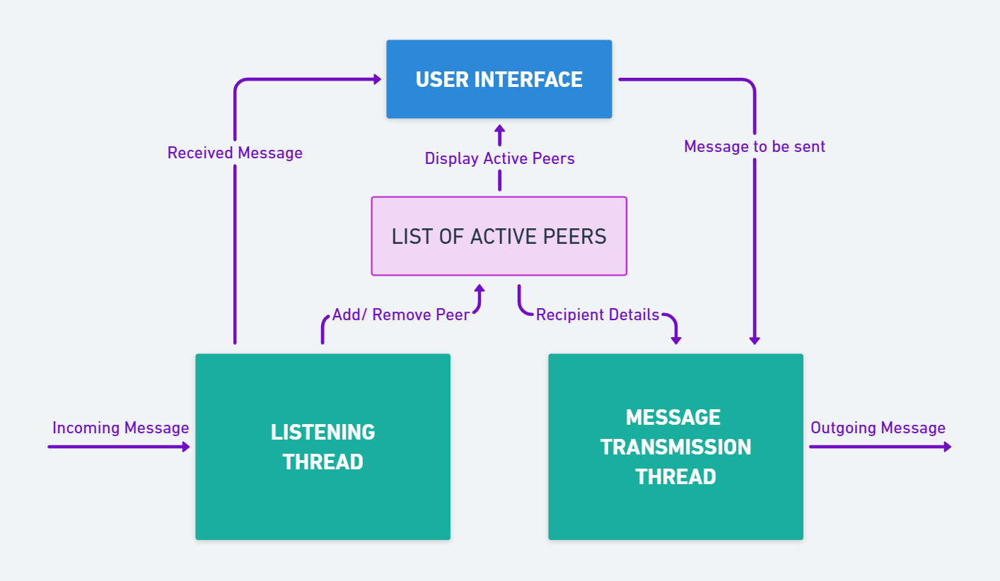

# Peer-to-Peer Chat Application
## Team Details

**Team Name**: Synergy

**Team Members**:
- Kartik Hiranandani (230001037)
- Keshav Singhal (230001039)
- Kumar Prince (230008019)

---
## Overview
This repository contains a Python implementation of a peer-to-peer  chat application which enables users to send and receive messages simultaneously, connect with multiple peers, and query active peers.
  
We have assumed fixed port numbers for all users (which they are asked to enter at startup) in order to avoid repeated entries for the same peer. The project has been developed using TCP sockets and a standardized message format to ensure reliable communication between peers. 

Our code also <b>handles the bonus question</b> by allowing users to connect to those active peers with whom connection has not yet been established.

---

## Implementation Details

### 1. List of Active Peers
The program maintains a dynamic list of active peers (peers that are available online and eligible for connection) at each user’s end. Each peer in this list has a connection status (Connected/ Yet to connect):  
- If the user receives a message from a peer not already in the list, then it is added to the list with <i>Yet to connect</i> connection status.  

- If the user successfully sends a message to a peer (IP address and port number to be known beforehand) that is not already in the list, then it is added to the list.  

- If the user sends the message <i>exit</i> to a peer, then he gets disconnected from that peer. Both users are removed from each other's active peers list.
- If the user chooses to quit (terminate his program), the message <i>exit</i> is automatically sent to all peers in his  list to remove him from their active peers lists.  

### 2. Connection Status of Peers
In the active peers list, each peer has a connection status:  

- **Connected**: If the user has successfully sent a connection message to that peer.  

- **Yet to connect**: If the user has not successfully sent a connection message to that peer yet.  

A message is considered as a connection message  if the message is <i>connect</i>. The program provides a dedicated function to send this connection message to some or all of those active peers which are yet to be connected.  

### 3. Message Notifications
A dedicated listener thread is used to receive messages in real-time, which keeps the user updated by notifying whenever:  

- A new peer is identified (by receiving a message for the first time).  
- A peer connects by sending a connection message.  
- A message is received from an active peer.  
- An active peer disconnects.  

---

## Customizations

### 1. Response Time Limit
The program is based on a synchronous networking model. By default, it assumes a maximum time limit of 20 seconds for sending a message over the network. This limit can be adjusted in the `settimeout()` method inside the `send_message()` function.  

### 2. Mandatory Peer List
The program initializes a list of already known peers and sends a greeting message to all of them at startup. The contents of the `mandatory_peers` list can be adjusted to include more mandatory peers.  

---
## How To Run ?
1. The program requires you to have Python 3.7.0 or any above version installed on your device.
2. The Python installation directory must be added to the system's `PATH` environment variable.
3. Run the Python file in a code editor like `Visual Studio Code`. In the output terminal, enter your name and a port number (say 8080) to display the menu of available options.
4. In order to run multiple instances in different terminals on your device, open the file in `Visual Studio Code` and for each instance,  press `Ctrl+F5`  to run the code in a new terminal. Make sure to use different port numbers for each terminal. 
6. To send a message from one terminal to another on the same device, you can enter the recipient IP Address as either `127.0.0.1` (local device) or the actual IP address. Avoid using both simultaneously since the program would assume the two IP addresses as different.
7. If running the code on different devices, ensure that the devices are on the same network without any VPN. There seems to be some issue with the code compatibility on IIT Wi-Fi networks. Hence, using a personal hotspot network is highly recommended.

## Acknowledgement  
- Prof. Subhra Mazumdar, for the project idea and concepts of peer-to-peer networks.  
- A helpful documentation of socket programming at [GeeksforGeeks](https://www.geeksforgeeks.org/socket-programming-python/).  
